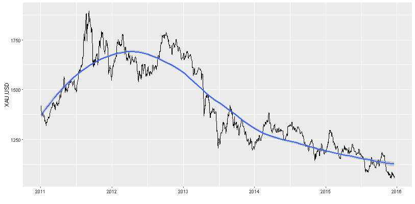

# Precious Metals Price ARIMA Forecast
## Coursera - Developing Data Products
* Author:  Enrique Pérez Herrero  
* Date: 20/Dec/2016  
* [Email](mailto:eph.project1500@gmail.com)  
* [GNU GENERAL PUBLIC LICENSE Version 2, June 1991](https://github.com/EnriquePH/Precious-Metals-Prediction)  
* [App url](https://kikesoft.shinyapps.io/Precious-Metals-Prediction)  
* [GitHub url](https://github.com/EnriquePH/Precious-Metals-Prediction)

## Description:
Precious Metals Price ARIMA Forecast App downloads the last five years prices
from [Oanda](http://www.oanda.com) and forecast the next year prices using
`auto.arima` function from `forecast` R package. 

## App Side Bar Panel

### Select Metal Input 

Select one of the known as precious metals:

| Metal     | Ticker |
|-----------|--------|
| Gold      | XAU    |
| Silver    | XAG    |
| Palladium | XPD    |
| Platinum  | XPT    |

### Select Currency Input 

One between US Dollars, British Pound, or Euro can be selected.

## App Tab Panels

App Tab panels are located above and can be selected like a menu.

### - Prices Plot  
Shows a price plot for the selected metal and currency, and a control to change
adjusted statistics: `linear` or `loess` 

### - Prices Table  
Shows the price table data for the selected metal and several currencies

### - Forecast Plot  
Shows the 
[ARIMA](https://en.wikipedia.org/wiki/Autoregressive_integrated_moving_average)
forecast for the next 365 days as a blue line, 80% confidence interval is 
displayed in orange, while 90% is in yellow.

### - Forecast Table  
Displays forecasted data table

### - Arima model  
Shows adjusted model using `auto.arima` from the `forecast` package

### - Differences Plot  
Plots first differences for the selected metal price and the differences of
base 10 logarithm of data 

### - Residuals Plot  
Plots the ACF and the
[PACF](https://en.wikipedia.org/wiki/Partial_autocorrelation_function)

## Links

* [Autoplot: Graphical Methods with ggplot2](http://librestats.com/2012/06/11/autoplot-graphical-methods-with-ggplot2/)

* [More blackbox analysis - Arima modeling in R](http://businessforecastblog.com/more-blackbox-analysis-arima-modeling-in-r/)

* [Precious Metals - Wikipedia](https://en.wikipedia.org/wiki/Precious_metal)

* [Palladium as an investment - Wikipedia](https://en.wikipedia.org/wiki/Palladium_as_an_investment)

* Step-by-Step Graphic Guide to Forecasting through ARIMA Modeling in R,
Manufacturing Case Study Example 
[(Part 4)](http://ucanalytics.com/blogs/step-by-step-graphic-guide-to-forecasting-through-arima-modeling-in-r-manufacturing-case-study-example/)

* Automatic Time Series Forecasting: The forecast Package for R  
[Journal of Statistical Software July 2008, Volume 27, Issue 3.](http://www.jstatsoft.org/article/view/v027i03)

* [Forecasting: principles and practice](https://www.otexts.org/fpp)

* [OANDA](http://www.oanda.com/)

